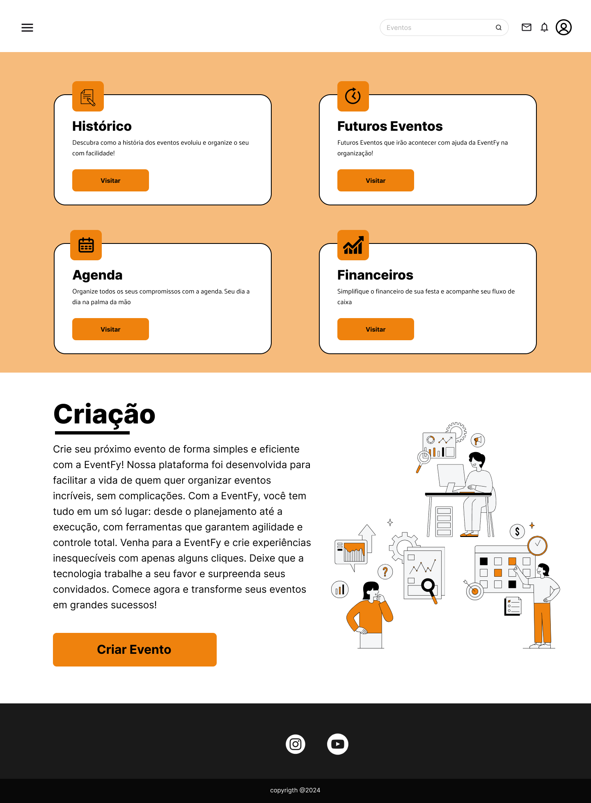

  

# EventFy - Event Management Platform

This project was developed in response to the need to create practical tools for organizing and managing events, aiming to streamline and optimize processes related to activity management. It was carried out as a final course project at ETEC Horácio Augusto da Silveira, completed in the year 2024.

---

## Objective

This project aims to resolve problems identified through a detailed investigation, which revealed the lack of functionalities in current platforms for more efficient task organization and more robust financial management.

---

## Features

EventFy has some main features, including:

1. **Event Management**: Organize and track all event details in one place.
2. **To-Do List**: Create and manage tasks for each event.
3. **Guest List**: Keep track of invited guests and their RSVPs.
4. **Financial Management**: Monitor budgets, expenses, and payments.
5. **Integrated Agenda**: Sync events with your calendar for better planning.

---

## Tools and technologies used

  
  
  
  
  
  
  
  
  
  
  
    
    
    
    

---

## System screens

Some of the system's main screens, more screens available on [*Figma*](https://www.figma.com/design/K6Rm3KtMaXtQy4jIuNdFXv/Untitled)

  

    <h2>Main</h2>
    
  

  

    <h2>Home page</h2>
    
  

  

    <h2>Event creation</h2>
    
  

---

## Microservices

### [*User registration*](https://github.com/GiovannePDS7/Cadastro_EventFy)
- Back-end for user registrations with Java and Spring Boot.

### [*JWT login*](https://github.com/GiovannePDS7/Login_EventFy)
- Login back-end using JWT Token in Java and Spring Boot.

### [*Event registration*](https://github.com/GiovannePDS7/CriacaoEvento_EventFy)
- Back-end for event registration using Java and Spring Boot.

### [*Retrieve event*](https://github.com/GiovannePDS7/EventoExistente_EventFy)
- Service to retrieve existing events based on the user.
  
### [*Register guests*](https://github.com/GiovannePDS7/Cadastro_ListaConvidados)
- Back-end to register guests per event.

### [*Register task*](https://github.com/GiovannePDS7/Cadastro_Tarefa)
- Back-end for registering tasks per event.

---

## Development team and their responsibilities

#### [*Giovanne Pagano*](https://github.com/GiovannePDS7)
- Project manager and leader;
- Full stack developer;
- System integration and hosting;

#### [*Anderson Armando*](https://github.com/Anderson-Armando)
- Project administrator;
- DataBase administrator;
  
#### [*João Eduardo*](https://github.com/juedu006)
- Project administrator;
- Front-end developer;
- UX/UI designer;

#### [*Pedro Henrique Soares*](https://github.com/PedroSoares22)
- DataBase administrator;

#### [*Henrique Lopes*](https://github.com/Henriqueluz21)
- Back-end developer;

#### [*Isabella Amaro*](https://github.com/Isabellinhaa)
- UX/UI designer;
